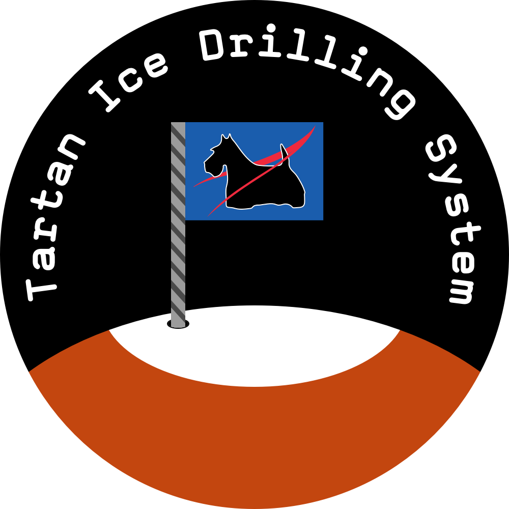

# tids-control-arduino

Fly-by-wire backup software for Martian ice extraction, developed for the NASA Mars Ice Challenge.

This is backup software used for testing and fly-by-wire control of the Tartan Ice Drilling System (TIDS) for water extraction from Martian subsurface ice. This software was built for the Arduino Mega, which served as a backup to the main BeagleBone Black computer.

For more information, view the main [tids-control software](https://github.com/TartanIceDrillingSystem/tids-control).

## Dependencies

- [HX711](https://github.com/bogde/HX711): Arduino library for the HX711 load cell

## Usage

This project is available open-source as a guide for future development of spacecraft and Martian technologies. As the software was developed to control the TIDS hardware components, running it standalone would not be very useful.
